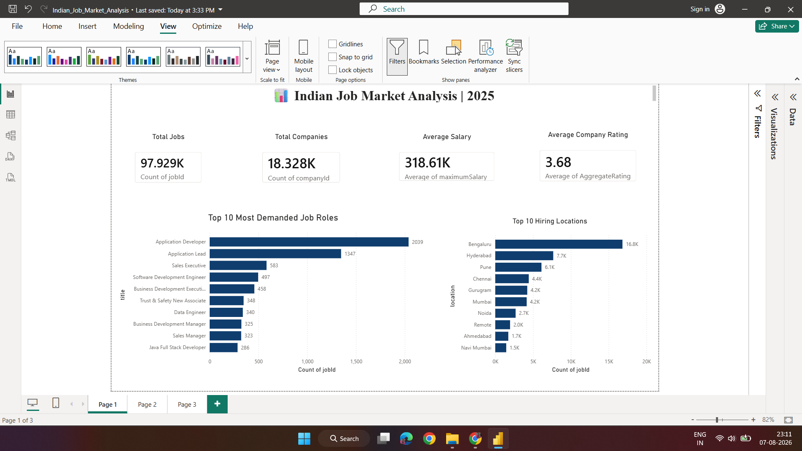
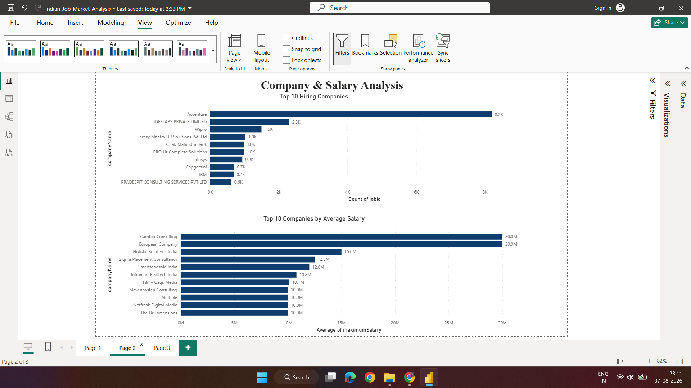
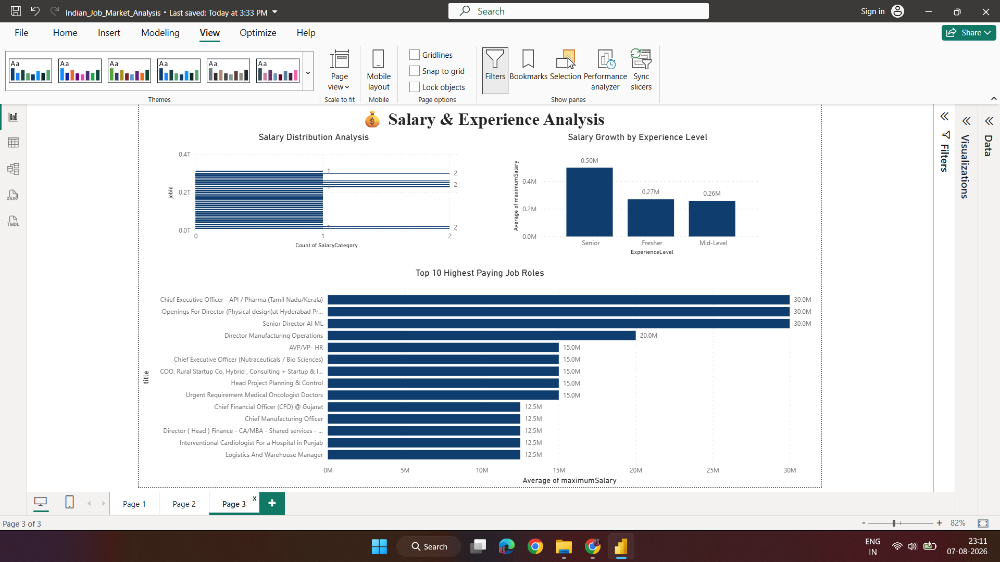

# 📊 Indian Job Market Analysis

An end-to-end **Data Analytics project** analyzing hiring trends, salary patterns, company recruitment activity, locations, skills, and experience requirements across the Indian job market.

**Python · SQL · Power BI · Pandas · SQLite**

---

## 📌 Project Overview

The **Indian Job Market Analysis** project is an end-to-end Data Analytics portfolio project that transforms raw job listing data into meaningful business insights.

The project combines **Python, SQL, and Power BI** for data cleaning, exploratory data analysis, analytical querying, and interactive dashboard development.

The analysis focuses on:

- 📈 Hiring trends and job demand
- 🏢 Company-wise recruitment activity
- 📍 Location-wise hiring patterns
- 💰 Salary distribution and compensation trends
- 👨‍💼 Experience-level requirements
- 🛠️ In-demand skills

---

## 🎯 Project Objectives

- Analyze job market trends across India.
- Identify high-demand job roles and locations.
- Discover leading hiring companies.
- Analyze salary patterns using minimum and maximum salary data.
- Compare opportunities across different experience levels.
- Identify in-demand skills.
- Build an interactive Power BI dashboard for business insights.

---

## 🛠️ Tools & Technologies

| Tool | Purpose |
|---|---|
| **Python** | Data cleaning & exploratory analysis |
| **Pandas** | Data manipulation |
| **NumPy** | Numerical analysis |
| **Matplotlib** | Data visualization |
| **SQL** | Analytical querying |
| **SQLite** | Database management |
| **Power BI** | Interactive dashboard development |
| **Jupyter Notebook** | Python analysis |
| **DB Browser for SQLite** | SQL database analysis |
| **VS Code** | Development environment |

---

## 📂 Project Structure
```
## 📂 Project Structure

```text
Indian-Job-Market-Analysis/
│
├── Dataset/
│   ├── indian-job-market-dataset-2025.xlsx
│   └── Top_20_Skills.csv
│
├── Documentation/
│   └── Indian Job Market Analysis.pdf
│
├── Images/
│   ├── company_salary_analysis.png
│   ├── dashboard_overview.png
│   └── salary_experience_analysis.png
│
├── PowerBI/
│   └── Indian_Job_Market_Analysis.pbix
│
├── Python/
│   └── Job_Market_Analysis.ipynb
│
├── SQL/
│   └── Indian_Job_Market_Analysis.sql
│
├── .gitignore
├── LICENSE
└── README.md
```

---

## 📊 Dashboard Preview

### 📌 Dashboard Overview




### 🏢 Company & Salary Analysis



### 💰 Salary & Experience Analysis



---

## 🔍 Key Insights

- **97,929 job listings** were analyzed to understand hiring patterns across the Indian job market.
- **18,623 unique companies** were identified through SQL analysis.
- **Bengaluru** was the leading hiring location with **16,823 job listings**, followed by **Hyderabad (7,669)** and **Pune (6,112)**.
- **80,503 listings** were classified as Low Salary, compared with **11,504 Medium** and **5,351 High Salary** listings.
- **Top hiring companies** were identified based on the volume of job postings.
- Hiring demand and salary patterns were compared across **Fresher, Mid-Level, and Senior** roles.
- **High-paying job opportunities** were identified using maximum salary analysis.
- **Top in-demand skills** were extracted and analyzed from job postings.

---

## 🧹 Data Preparation

The dataset was cleaned and prepared using **Python and Pandas** before SQL analysis and Power BI visualization.

Key data preparation steps included:

- Removed **247 duplicate records**.
- Handled missing values in key columns.
- Converted salary and experience fields to appropriate numeric data types.
- Converted `jobUploaded` to datetime format.
- Created `SalaryCategory` to classify salary ranges.
- Created `ExperienceLevel` to categorize jobs into **Fresher, Mid-Level, and Senior**.
- Prepared the cleaned dataset for SQL analysis and Power BI reporting.

---

## 📈 Dashboard Features

The Power BI dashboard provides an interactive view of the Indian job market through:

- 📌 Interactive KPI Cards
- 💼 Job Role Analysis
- 🏢 Company-wise Hiring Analysis
- 📍 Location-wise Hiring Trends
- 💰 Salary Distribution
- 👨‍💼 Experience Level Analysis
- 🛠️ Skills Analysis
- 🎛️ Interactive filters and visualizations

---

## 🔄 Project Workflow

```text
Raw Dataset
     ↓
Python Data Cleaning
     ↓
Exploratory Data Analysis
     ↓
SQL Analysis
     ↓
Power BI Dashboard
     ↓
Business Insights

Workflow Steps

Data Collection – Imported the Indian job market dataset.
Data Cleaning – Removed duplicates, handled missing values, and corrected data types using Python and Pandas.
Exploratory Data Analysis – Analyzed job roles, locations, salaries, companies, experience levels, and skills.
SQL Analysis – Performed analytical queries using SQLite to identify hiring and salary trends.
Power BI Development – Built an interactive dashboard with KPIs, charts, filters, and business-focused visualizations.
Business Insights – Identified key hiring patterns, salary trends, high-demand locations, and experience-level requirements.
```

---

## 🚀 How to Run the Project
```bash
### 1. Clone the Repository

git clone https://github.com/Puja17k2000/Indian-Job-Market-Analysis.git
cd Indian-Job-Market-Analysis

### 2. Python Analysis

Open the Python notebook:

[Job_Market_Analysis.ipynb](Python/Job_Market_Analysis.ipynb)

Run the notebook using **Jupyter Notebook** or **VS Code**.

### 3. SQL Analysis

Open the SQL script:

[Indian_Job_Market_Analysis.sql](SQL/Indian_Job_Market_Analysis.sql)

The SQL queries can be executed using **SQLite** or **DB Browser for SQLite**.

### 4. Power BI Dashboard

Open the Power BI dashboard:

[Indian_Job_Market_Analysis.pbix](PowerBI/Indian_Job_Market_Analysis.pbix)

Open the file using **Power BI Desktop**.
```
---


## 📄 Documentation

The complete project report is available here:

[Indian Job Market Analysis.pdf](Documentation/Indian%20Job%20Market%20Analysis.pdf)

The report includes the project methodology, data preparation, analysis, dashboard development, and key findings.

---

## 👩‍💻 Author

### Puja Kumari

**Aspiring Data Analyst**

**Skills:** Python · SQL · Power BI · Excel · Data Analysis

- **GitHub:** [Puja17k2000](https://github.com/Puja17k2000)
- **LinkedIn:** [Puja Kumari](https://www.linkedin.com/in/puja-k-231227277)

---

⭐ If you found this project useful, consider giving this repository a star!


